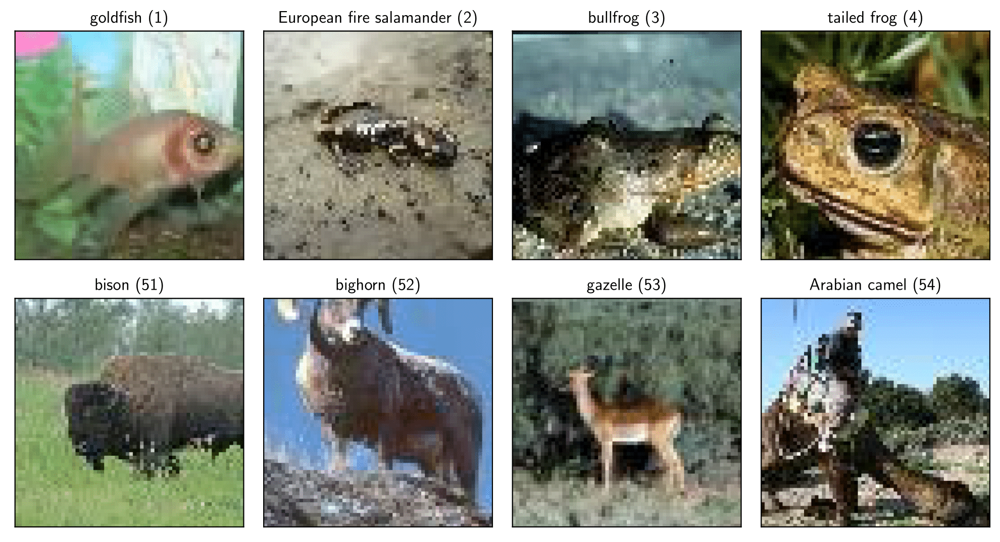

# Similarity Classification with Siamese Networks

In this work, we explore the task of image-matching with 100 classes of the Tiny ImageNet Visual Recognition Challenge data set. In the presented image-matching task, a model is presented with two images, and the model should predict if the images are from the same class of images.

 We use the ResNet18 architecture and develop two siamese model architectures: (1) the Binary Classification architecture is a siamese network that performs a direct and straightforward binary classification from the features of the ResNet18 model. (2) The Contrastive Loss model uses a siamese ResNet18 architecture that learns pseudo-classes from the training data. The pseudo-class outputs are then compared with the cosine similarity function. Both architectures are trained with randomly initialised and pretrained weights for the ResNet18 model. The training metrics are logged on [tensorboard.dev](https://tensorboard.dev/experiment/YSwhPLGIR1WDQTWvDHX8uQ/#scalars).

## Binary Classification Architecture
### Architecture
The Binary Classification (BC) model is a Siamese network, consisting of two ResNet18 models sharing their weights. Each ResNet18 model extracts features from the respective input image up to the average pooling function. The fully connected layer and the softmax function are omitted, so the features can be concatenated into a fully connected layer with a rectified linear unit (ReLU) activation function and one output dimension. A sigmoid function $S(x)$ maps the output between 0 and 1, representing the labels _dissimilar_ with $S(x) < 0.5$  and _similar_ with $S(x) \geq 0.5$. This architecture is motivated by using the features of the ResNet18 architecture and modifying the models’ tail to output a direct and straight-forward binary classification.

## Contrastive Loss Architecture

### Architecture

The Contrastive Loss (CL) model is also a siamese network, consisting of two ResNet18 models sharing their weights. Again, the ResNet18 models extract features from the respective input images up to the average pooling function. In the CL model, the Siamese network continues with separate fully connected layers and a Softmax function $\sigma(\boldsymbol{x})_i$:
$$\sigma(\boldsymbol{x})_i = \frac{e^{x_i}}{\sum^{K}_{j=1}e^{z_j}} \text{  for  } i = 1,\dots,K$$
with $K = 50$. $K$ is set to the number of classes in the dataset on purpose: The output of the Softmax function should converge to a 50-dimensional vector where one dimension would have most of the mass of the Softmax distribution. In this way, the model learns pseudo-classes for the image inputs from the features provided by the ResNet18 model. As the output of the Softmax functions is strictly positive, the Cosine similarity function $\operatorname{CS}(\boldsymbol{x}_1, \boldsymbol{x}_2)$
$$\operatorname{CS}(\boldsymbol{x}_1, \boldsymbol{x}_2) = \frac{\boldsymbol{x}_1 \cdot \boldsymbol{x}_2}{|\boldsymbol{x}_1|\cdot|\boldsymbol{x}_2|}$$
returns results between 0 and 1. Assuming that the adjusted ResNet18 model returns vectors where the majority of the mass is assigned to one dimension, different classes would map to perpendicular vectors in the 50-dimensional output space, resulting in a low output of $\operatorname{CS}(\boldsymbol{x}_1, \boldsymbol{x}_2)$, while the output vectors of similar images would align, resulting in a high output of $\operatorname{CS}(\boldsymbol{x}_1, \boldsymbol{x}_2)$. The model architecture for the Contrastive Loss model consists of 11.3 million parameters

## Results

### Results for randomly initialised weights.

### Results for pretrained weights.

